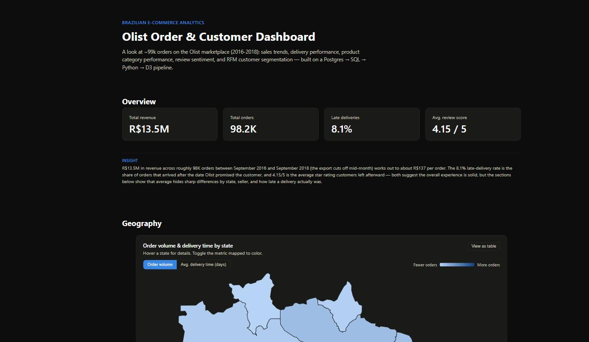

# Olist E-Commerce Analytics Dashboard

**[Live demo →](https://olist-ecommerce-dashboard-sigma.vercel.app/)**

An interactive analytics dashboard for the [Olist Brazilian e-commerce marketplace](https://www.kaggle.com/datasets/olistbr/brazilian-ecommerce) (~99k orders, 2016–2018) — sales trends, delivery performance, product category performance, review sentiment, and RFM customer segmentation, built end to end as a real data pipeline (raw CSVs → cleaned relational database → SQL analysis → static export → interactive frontend) rather than a single notebook.



## Tech stack

**Frontend**
- **React 19** + **TypeScript** — component structure and type safety across ~40 components
- **D3.js** (`d3`, `d3-geo`) — every chart is hand-built with D3 scales, shape generators, and geo projections, not a chart-library wrapper; includes a custom Brazil choropleth with `topojson-client`
- **Vite** — build tooling and dev server
- **CSS Modules** — scoped component styling, with a shared design-token system (light/dark mode via CSS custom properties)
- **oxlint** — linting

**Data pipeline**
- **Python** (**pandas**) — CSV ingestion, cleaning, type coercion, source-data gap handling
- **SQLAlchemy** + **psycopg2** — database connectivity for both the load and export steps
- **PostgreSQL**, hosted on **[Neon](https://neon.tech)** (serverless Postgres) — the actual analytical engine; 12 SQL queries using CTEs, window functions (`NTILE`), joins, `CASE` expressions, and date/time arithmetic
- Static **JSON** export — decouples the deployed frontend from the live database entirely

**Infrastructure**
- **Vercel** — static hosting, deploys automatically on every push to `main`
- **GitHub** — version control
- **mapshaper** — one-time geometry simplification for the Brazil state-boundary map data (5.6MB raw → 256KB shipped)

## The pipeline

```
Kaggle CSVs (datasets/)
        │
        ▼
Python ingestion (python/ingest/)
  pandas cleaning, type coercion, load into Postgres
        │
        ▼
PostgreSQL on Neon
  normalized schema mirroring the source tables
        │
        ▼
SQL analysis queries (sql/queries/)
  CTEs, window functions, joins — sales trends, delivery
  performance, RFM segmentation, review analysis, geography,
  category performance (12 queries, one per file)
        │
        ▼
Python export (python/export/)
  runs every query, writes results as static JSON
        │
        ▼
React + TypeScript + D3 dashboard (dashboard/)
  reads the prebuilt JSON — no live database in production
        │
        ▼
Vercel
  static build, auto-deployed from this repo
```

Postgres is the analytical engine used during development (and where all the SQL
work actually happens); the deployed site never queries it live. That keeps the
public demo fast and free to host while the SQL layer stays real and inspectable
in this repo.

## Key analyses

- **Sales trends** — monthly revenue/order volume, overall and by category
- **Geographic breakdown** — order volume, delivery time, and revenue by state (feeds a D3 choropleth of Brazil, with each state's revenue shown as a share of the national total)
- **Delivery performance** — actual vs. estimated delivery date, late-delivery rate by state and seller
- **Review analysis** — average score by delivery-delay bucket and by category
- **Category performance** — revenue vs. review score by product category
- **Customer segmentation (RFM)** — Recency/Frequency/Monetary scoring via `NTILE` window functions, segmented into Champion/Loyal/At risk/Hibernating

Every chart has a plain-language "Insight" note explaining what it actually shows —
written for a non-technical reader, not just someone who already knows the domain
vocabulary.

## SQL techniques demonstrated

- **CTEs** to stage multi-step calculations readably, and to combine metrics that need genuinely different row filters (e.g. delivery time requires delivered orders only, revenue shouldn't)
- **Window functions** (`NTILE`) for RFM quintile scoring, with a documented tiebreaker fix for a dataset dominated by one-time buyers
- **`CASE` expressions** for bucketing (delivery-delay ranges, RFM segment labels) and conditional aggregation (`AVG(CASE WHEN ... THEN score END)` to compute two averages in one pass)
- **Date/time arithmetic** (`EXTRACT(EPOCH FROM ...)`) to convert Postgres intervals into plain numeric days
- **`HAVING`** to filter aggregated groups by sample size, so low-volume outliers don't skew a "worst performers" ranking

## Repository structure

```
datasets/                 raw Kaggle CSVs (gitignored — see datasets/README.md)
python/
  ingest/                 CSV -> Postgres load script
  export/                 runs every SQL query, writes JSON
sql/
  schema.sql               table definitions
  SQL_GUIDE.md              plain-English walkthrough of every schema concept
  queries/                  one .sql file per analysis (12 files)
dashboard/
  src/
    components/
      charts/               one component per visualization, grouped by section
      layout/                shared primitives (ChartCard, Tooltip, Legend, InsightNote, ...)
    lib/                    data fetching, formatting, color scales, palette
    types/                  TypeScript interfaces mirroring the JSON shapes
  public/data/              generated JSON (committed as a build artifact)
  public/geo/                Brazil state boundary TopoJSON
ARCHITECTURE.md            fuller design write-up and phased roadmap
```

## Running it locally

**1. Get the data**
Download the 9 CSVs from the [Kaggle dataset](https://www.kaggle.com/datasets/olistbr/brazilian-ecommerce) into `datasets/` (see `datasets/README.md`).

**2. Load into Postgres**
```
cd python/ingest
cp .env.example .env   # fill in your own Neon (or any Postgres) connection string
python -m venv ../../.venv && ../../.venv/Scripts/activate  # or source ../../.venv/bin/activate
pip install -r requirements.txt
# run sql/schema.sql against your database, then:
python load_to_postgres.py
```

**3. Export the analysis to JSON**
```
cd python/export
python export_to_json.py
```
This runs every query in `sql/queries/` and writes results into `dashboard/public/data/`.

**4. Run the dashboard**
```
cd dashboard
npm install
npm run dev
```

## Data attribution

Dataset: [Brazilian E-Commerce Public Dataset by Olist](https://www.kaggle.com/datasets/olistbr/brazilian-ecommerce), via Kaggle. Brazil state boundary data: [giuliano-macedo/geodata-br-states](https://github.com/giuliano-macedo/geodata-br-states) (MIT), derived from LAGEAMB-UFPR/IBGE.
